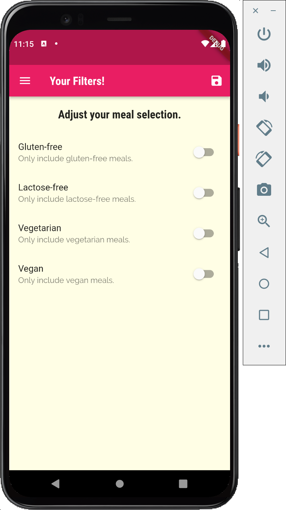

# flutter_meals_app

An app that can check different categories of meals, ingredients, and steps to make the meals.

## Function used

1. This project uses Screens, Routes, Pages.
2. Passing Data via arguments
3. Add AppBar at the bottom of the page and allows user to switch between different stack
4. Drawers is used

## App Look
<table>
  <tr>
    <td>First Screen Page</td>
     <td>Holiday Mention</td>
     <td>Present day in purple and selected day in pink</td>
  </tr>
  <tr>
    <td></td>
    <td></td>
    <td></td>
  </tr>
 </table>